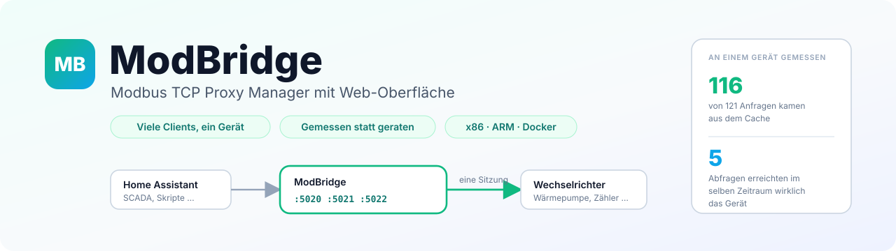
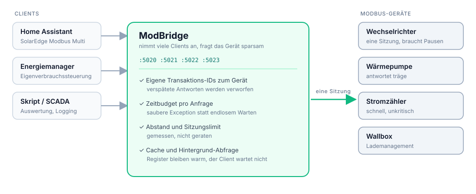
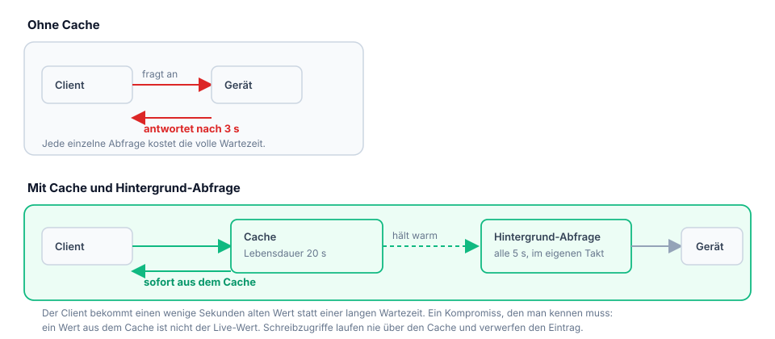
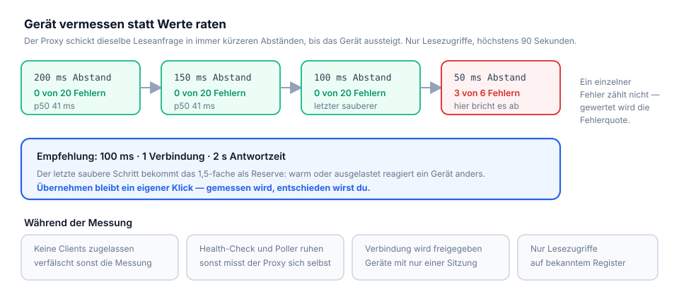
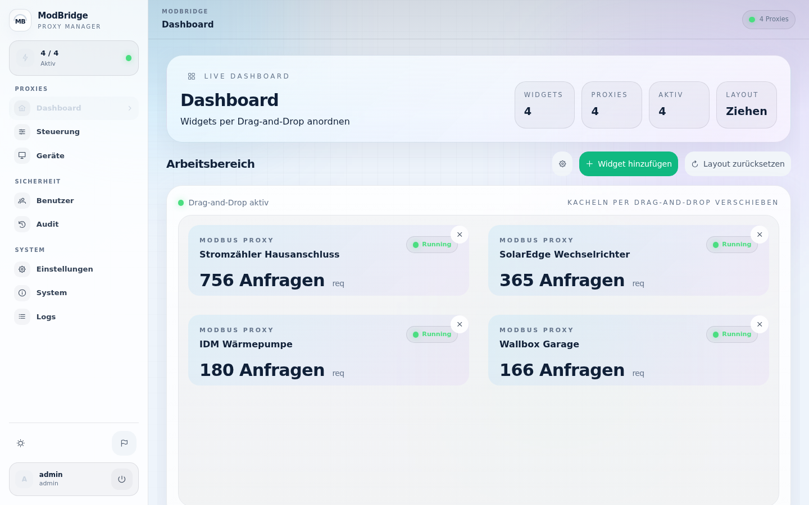
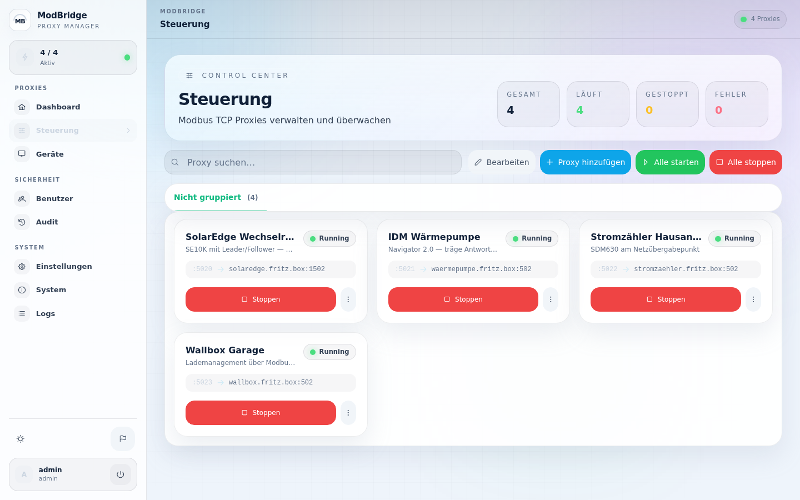
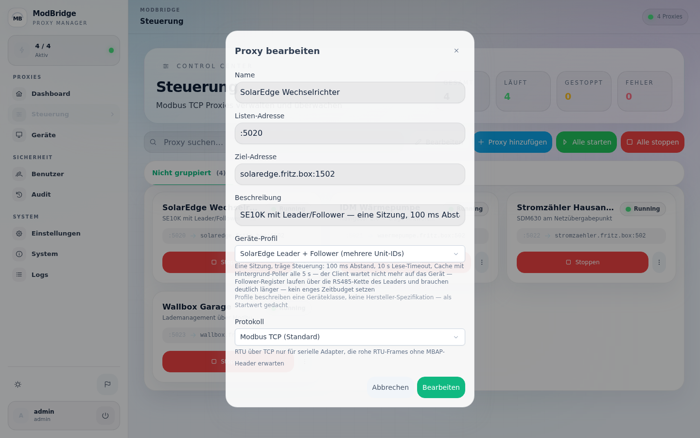
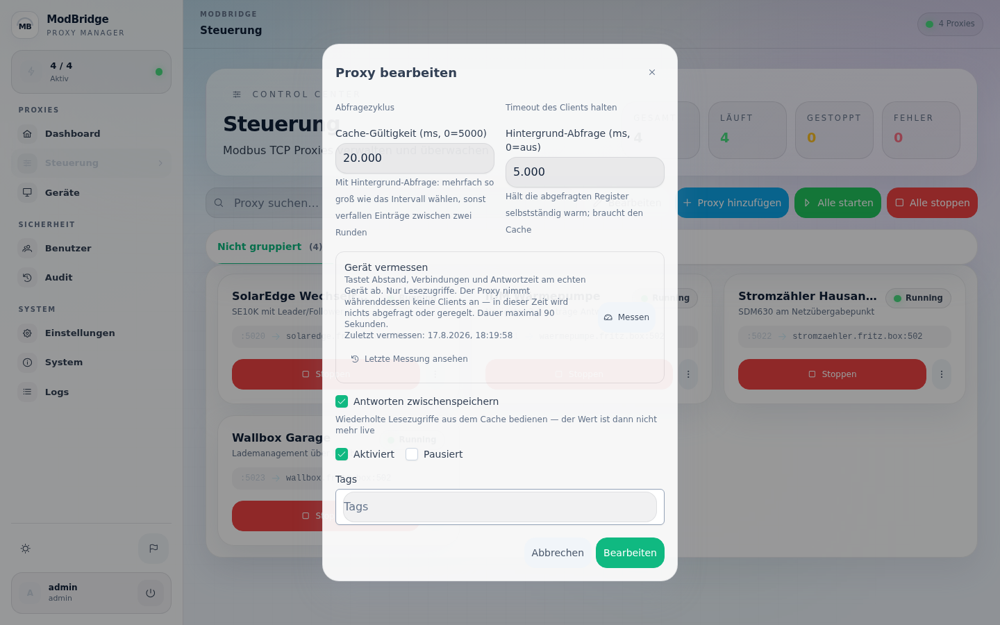

# ModBridge - Modbus TCP Proxy Manager

**Version:** v2.0.4

[](https://github.com/xerolux/modbridge/releases)
[](https://github.com/xerolux/modbridge/releases)
[](https://github.com/xerolux/modbridge/commits/main)
[](https://github.com/Xerolux/modbridge/blob/main/LICENSE)
[](https://github.com/Xerolux/modbridge/actions/workflows/ci.yml)

[](https://github.com/sponsors/xerolux)
[](https://ko-fi.com/xerolux)
[](https://www.buymeacoffee.com/xerolux)
[](https://paypal.me/xerolux)
[](https://ts.la/sebastian564489)



**ModBridge** ist ein moderner, robuster Modbus TCP Proxy Manager mit einer eleganten Web-Oberfläche. Er ermöglicht das Multiplexing und Management von Modbus-Verbindungen und bietet detailliertes Monitoring, Logging und Sicherheit in einem kompakten, einfach bereitzustellenden Paket.

## 📖 Ausführliche Dokumentation (Wiki)

Alle ausführlichen Informationen zu Konfiguration (Web-UI & Headless) und Nutzung finden Sie in unserem **[GitHub Wiki](https://github.com/Xerolux/modbridge/wiki)**.

### Schnellzugriff:
- ⚙️ **[Konfiguration (WebUI & Headless)](https://github.com/Xerolux/modbridge/wiki/Konfiguration)**
- 🔧 **[Features & API](https://github.com/Xerolux/modbridge/wiki/Features-und-API)**
- 🩺 **[Troubleshooting](https://github.com/Xerolux/modbridge/wiki/Troubleshooting)**

---

## ⚙️ Was ModBridge zwischen Client und Gerät tut

Ein Proxy ist kein Kabel. ModBridge sitzt zwischen deinem Client (Home
Assistant, SCADA, eigenes Skript) und dem Modbus-Gerät und löst die Probleme,
die dort entstehen:



**Ohne Konfiguration, immer aktiv:**

- **Transaktions-Zuordnung** — zum Gerät hin vergibt ModBridge eigene
  Transaktions-IDs und verwirft Antworten, die nicht zur laufenden Anfrage
  gehören. Ohne das wird eine verspätete Antwort zur Antwort auf die *nächste*
  Anfrage, und ab da schlägt jede Abfrage fehl.
- **Zeitbudget pro Anfrage** — läuft es ab, kommt eine saubere Modbus-Exception
  statt einer verspäteten Antwort, auf die niemand mehr wartet.

**Pro Proxy einstellbar, standardmäßig aus:**

| Option | Wofür |
|--------|-------|
| `max_target_conns` | Geräte, die nur eine Modbus-Sitzung bedienen (SolarEdge/SunSpec und viele Wechselrichter) |
| `min_request_gap_ms` | Geräte, die Anfragen ohne Pause verwerfen. Achtung: der Wert kostet **pro Anfrage** |
| `request_timeout_ms` | Harte Obergrenze inklusive Wiederholungen |
| `cache_enabled` + `poll_interval_ms` | Register im Hintergrund warm halten, damit der Client nicht auf ein träges Gerät wartet |

**In der Oberfläche:**

- **Geräte-Profile** — rund 60 Einträge in sieben Kategorien (Wechselrichter,
  Wärmepumpen, Lüftung, Zähler, Speicher, Wallboxen, Allgemein). Sie füllen das
  Formular mit Werten, die zur Geräteklasse passen, und ändern sonst nichts.
- **Gerät vermessen** — tastet Abstand, Verbindungen und Antwortzeit am echten
  Gerät ab und schlägt Werte vor, statt sie zu schätzen. Nur Lesezugriffe,
  höchstens 90 Sekunden, und übernommen wird erst auf Klick. Während der
  Messung nimmt der Proxy keine Clients an.

Details dazu im [Wiki](https://github.com/Xerolux/modbridge/wiki):
[Konfiguration](https://github.com/Xerolux/modbridge/wiki/Konfiguration) und
[Troubleshooting](https://github.com/Xerolux/modbridge/wiki/Troubleshooting).

### Cache und Hintergrund-Abfrage

Ein träges Gerät lässt jeden Client warten. Der Cache hält die Register warm,
die tatsächlich abgefragt werden, und die Hintergrund-Abfrage frischt sie im
eigenen Takt auf — der Client bekommt seine Antwort sofort, das Gerät wird
seltener gefragt.



Beides ist standardmäßig aus, denn der Kompromiss will bewusst gewählt sein:
**ein Wert aus dem Cache ist nicht der Live-Wert.** Schreibzugriffe laufen nie
über den Cache und verwerfen den betroffenen Eintrag.

### Gerät vermessen

Statt Werte zu schätzen, misst ModBridge sie am Gerät vor dir: der Abstand
zwischen Anfragen wird schrittweise verkürzt, bis das Gerät Anfragen verwirft,
und der letzte saubere Schritt bekommt eine Reserve.



## 🚀 Installation mit `modbridge` (empfohlen)

Das Installationsskript übernimmt alles: Binary-Download, systemd-Service mit Autostart und Einrichtung als systemweites CLI-Kommando (`modbridge`).

### Quick Install (einzeilig)

```bash
curl -sSL https://raw.githubusercontent.com/Xerolux/modbridge/main/scripts/modbridge.sh | sudo bash -s install
```

### Schritt für Schritt

```bash
# 1. Skript herunterladen
curl -sSL -o modbridge.sh https://raw.githubusercontent.com/Xerolux/modbridge/main/scripts/modbridge.sh
chmod +x modbridge.sh

# 2. Installieren (interaktiv mit Menü)
sudo bash modbridge.sh install

# 3. Danach ist 'modbridge' systemweit verfügbar
sudo modbridge status
```

### Was passiert bei der Installation?

| Schritt | Beschreibung |
|---------|-------------|
| Architektur erkennen | amd64, arm64 oder arm automatisch erkannt |
| Variante wählen | Full (mit WebUI) oder Headless (ohne WebUI) |
| Version wählen | Neueste Release von GitHub, oder ältere wählen |
| Binary download | Passende Binary nach `/opt/modbridge/modbridge` |
| Script installieren | Skript nach `/usr/local/bin/modbridge` kopiert |
| systemd-Service | Service mit Autostart erstellt und gestartet |

Nach der Installation startet ModBridge automatisch bei jedem Systemstart. Alle konfigurierten Proxies werden automatisch mitgestartet.

### Alle Befehle

```bash
modbridge                          # Interaktives TUI-Menü (whiptail)
modbridge install [--auto]         # Installieren (oder Neuinstallation)
modbridge update [--auto]          # Aktualisieren
modbridge start                    # Service starten
modbridge stop                     # Service stoppen
modbridge restart                  # Service neustarten
modbridge status                   # Status anzeigen
modbridge logs [-f]                # Logs (live mit -f)
modbridge health                   # Health-Check
modbridge config                   # Config bearbeiten (nano/vi)
modbridge backup                   # Config + DB sichern
modbridge version                  # Version anzeigen
modbridge uninstall                # Vollständig entfernen
```

### Optionen

| Option | Beschreibung |
|--------|-------------|
| `--auto` | Automatischer Modus: neueste Version, WebUI, keine Dialoge |
| `--headless` | Automatischer Modus, Headless-Variante |
| `--force` | Installation erzwingen (überschreibt bestehende) |
| `NO_UPDATE=1` | Script-Auto-Update überspringen |

### Selbst-Update

Das Skript prüft bei **jedem Aufruf** automatisch auf eine neuere Version. Falls verfügbar, lädt es die neue Version herunter und startet sich selbst neu. Kein manuelles Eingreifen nötig.

```bash
# Prüft automatisch auf Script-Updates, dann installieren
sudo modbridge install

# Update-Prüfung überspringen
NO_UPDATE=1 sudo modbridge install
```

### Update & Neuinstallation — Daten bleiben erhalten

ModBridge schützt Ihre Daten bei Updates und Neuinstallationen:

| Aktion | Config (`config.json`) | Datenbank (`modbridge.db`) | Proxies |
|--------|----------------------|---------------------------|---------|
| `modbridge update` | **Erhalten** + Backup | **Erhalten** | **Erhalten**, Service wird neugestartet |
| `modbridge install` (bereits installiert) | **Erhalten** — bietet Update an | **Erhalten** | **Erhalten** |
| `modbridge install --force` | **Erhalten** + Backup | **Erhalten** | **Erhalten**, Neuinstallation |
| `modbridge uninstall` | Gelöscht (Backup optional) | Gelöscht (Backup optional) | Gelöscht |

**Update-Prozess im Detail:**
1. Service wird gestoppt
2. Config wird automatisch nach `/opt/modbridge/backups/` gesichert
3. Alte Binary wird als `modbridge.backup.ZEITSTEMPEL` behalten
4. Neue Binary wird heruntergeladen
5. Service wird neugestartet
6. Falls der Start fehlschlägt → automatisches Rollback auf die vorherige Binary

**Neuinstallation** (z.B. nach Versionswechsel Full ↔ Headless):
```bash
sudo modbridge install --force
# Config und DB bleiben erhalten, nur Binary wird ausgetauscht
```

### Manuelle Backup-Verwaltung

```bash
# Backup erstellen
sudo modbridge backup
# → /opt/modbridge/backups/config-20260401_120000.json
# → /opt/modbridge/backups/db-20260401_120000.db

# Config bearbeiten
sudo modbridge config

# Nach Config-Änderungen Service neustarten
sudo modbridge restart
```

### Unterstützte Architekturen

| Architektur | System |
|------------|--------|
| `amd64` | Intel/AMD 64-bit (Standard Server, PC) |
| `arm64` | ARM 64-bit (Raspberry Pi 4/5, ARM Server) |
| `arm` | ARM 32-bit (Raspberry Pi Zero/1/2/3, 32-bit OS) |

---

## 🐳 Docker Deployment

Alternative Installation via Docker Compose:

```yaml
version: '3.8'

services:
  modbridge:
    image: ghcr.io/xerolux/modbridge:latest
    container_name: modbridge
    restart: unless-stopped
    ports:
      - "8080:8080"
      - "5020-5030:5020-5030" # Port-Range für Proxies
    volumes:
      - ./config.json:/app/config.json
      - ./data:/app/data
```

```bash
docker-compose up -d
```

---

## 💻 Web-UI

Nach der Installation (Full-Variante) ist die Web-UI erreichbar unter:

```
http://<IP-DES-SERVERS>:8080
```

Das Admin-Passwort wird beim ersten Start automatisch generiert und in den Logs angezeigt:

```bash
modbridge logs | grep -i password
```

### So sieht das aus

| | |
|---|---|
|  |  |
| **Dashboard** — Zustand aller Proxys auf einen Blick | **Steuerung** — Proxys anlegen, starten, gruppieren |
|  |  |
| **Proxy-Dialog** — Profil, Abstand, Cache, Protokoll | **Vermessen** — misst das Gerät, statt Werte zu raten |

Weitere Ansichten — Geräte, Logs, dunkles Design und Handy-Format — im
[Wiki](https://github.com/Xerolux/modbridge/wiki/Images).

---

## 🛠️ Entwicklung & Build

Möchten Sie selbst Hand anlegen oder das Projekt aus den Quellen kompilieren?
Informationen zu `make`-Befehlen, Frontend-Build und mehr finden Sie im Wiki.

Lokaler Build:
```bash
make build
./modbridge
```

---

## 🤝 Beitragen
Beiträge sind willkommen! Bitte lesen Sie [CONTRIBUTING.md](CONTRIBUTING.md) für Details.

## 📄 Lizenz
MIT License - siehe [LICENSE](LICENSE) für Details.

## ✍️ Autor
- **Xerolux** - [GitHub](https://github.com/Xerolux)

---
**Version**: 1.0.17 | **Status**: Beta | **Letzte Aktualisierung**: April 2026
