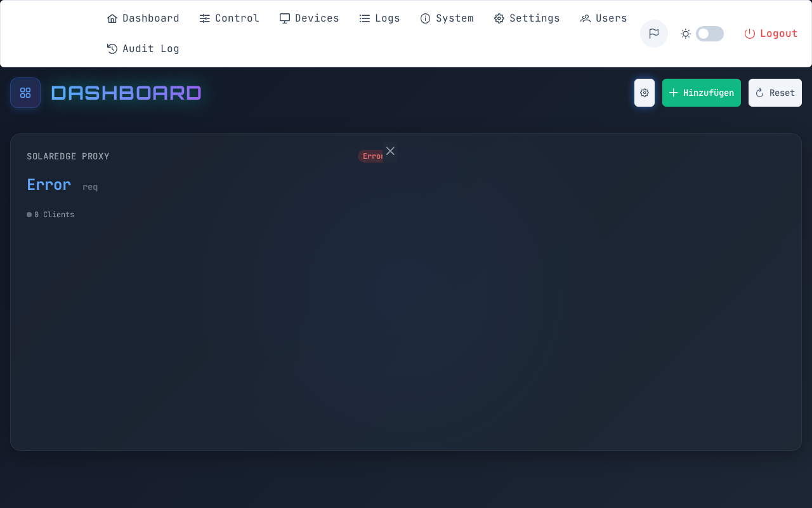
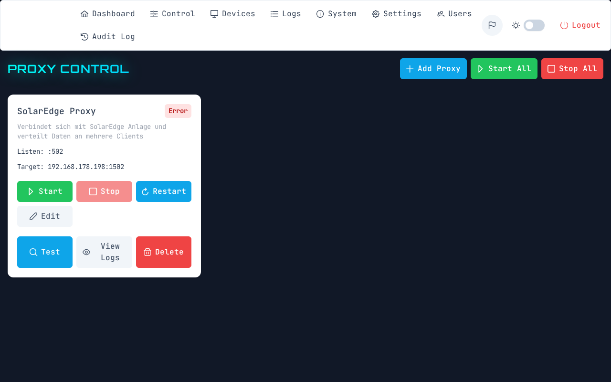
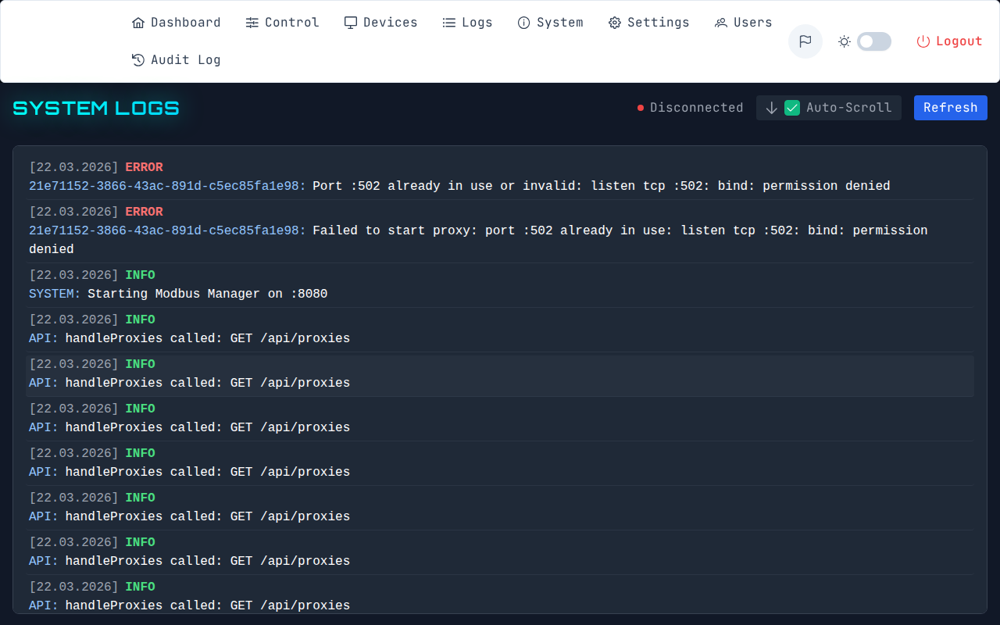
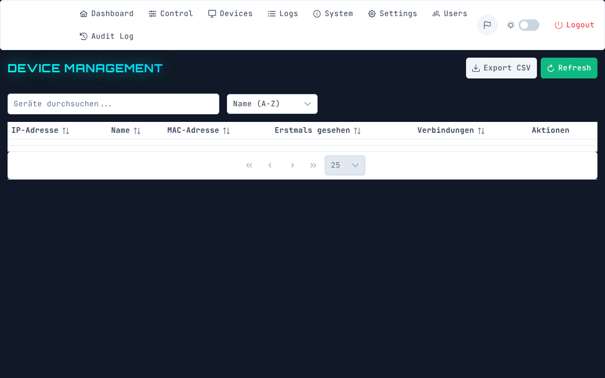
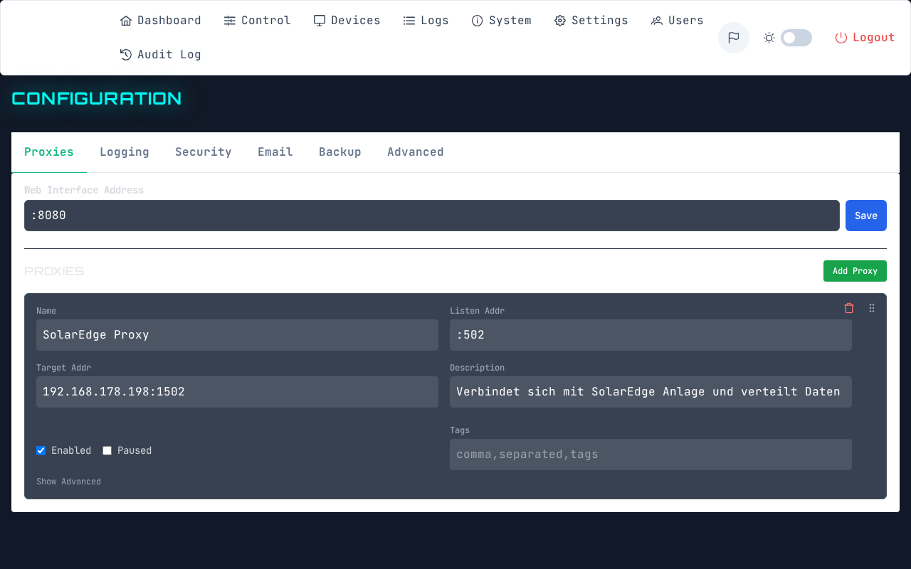

# Web-UI Vorschau / Screenshots

ModBridge verfügt über eine elegante und reaktionsschnelle Benutzeroberfläche. Hier finden Sie einige Eindrücke des Systems:

### Dashboard
*(Bildplatzhalter für Dashboard)*

### Proxy-Verwaltung
*(Bildplatzhalter für Proxies)*

### Live-Logs
*(Bildplatzhalter für Logs)*

### Geräte-Tracking
*(Bildplatzhalter für Devices)*

### Konfiguration
*(Bildplatzhalter für Konfiguration)*

---
*Hinweis für Entwickler/Maintainer:* Bitte laden Sie die entsprechenden `.png` Dateien in den Ordner `docs/assets/screenshots/` hoch, damit diese auf der GitHub Pages / Wiki Seite korrekt dargestellt werden.
