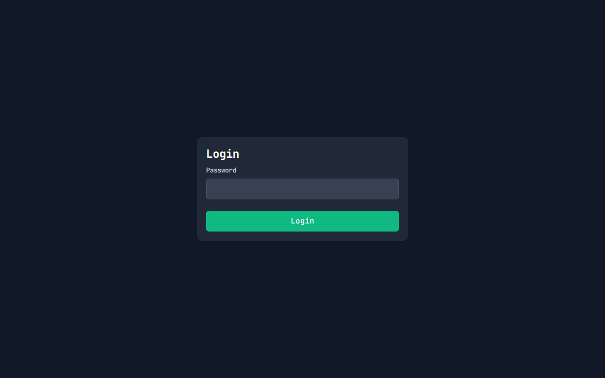

# Web-UI Vorschau / Screenshots

ModBridge verfügt über eine elegante und reaktionsschnelle Benutzeroberfläche. Hier finden Sie einige Eindrücke des Systems:

### Dashboard

### Proxy-Verwaltung

### Live-Logs

### Geräte-Tracking

### Konfiguration

### Login

