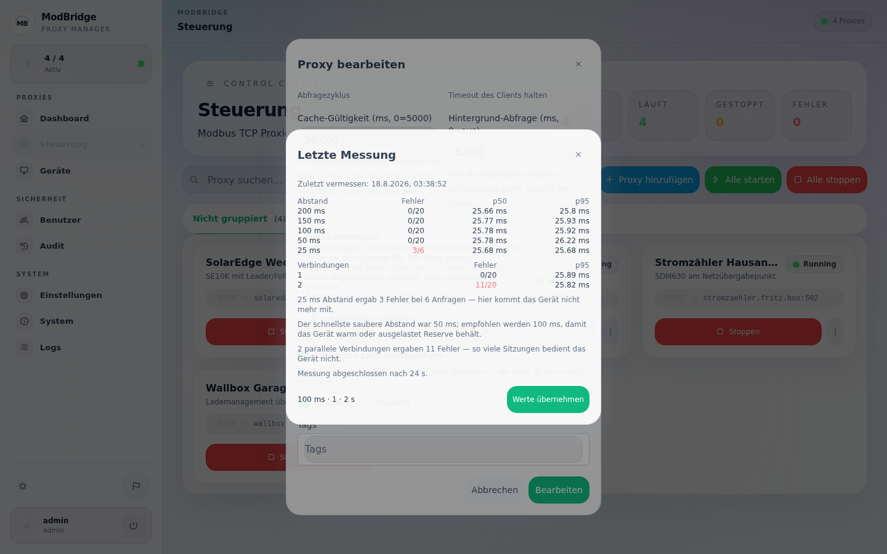
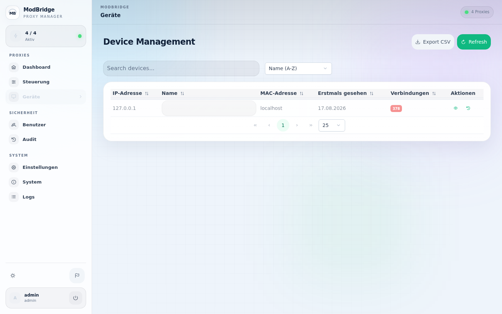
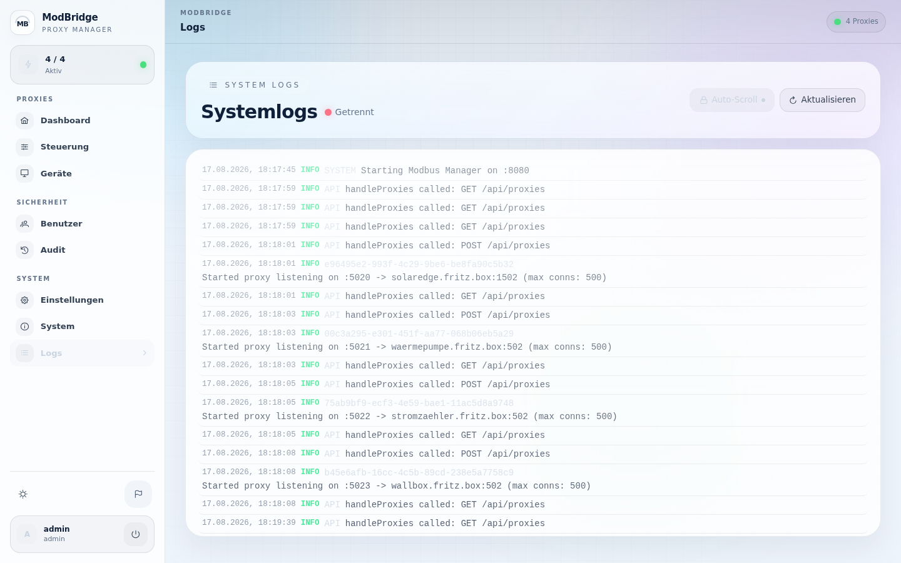
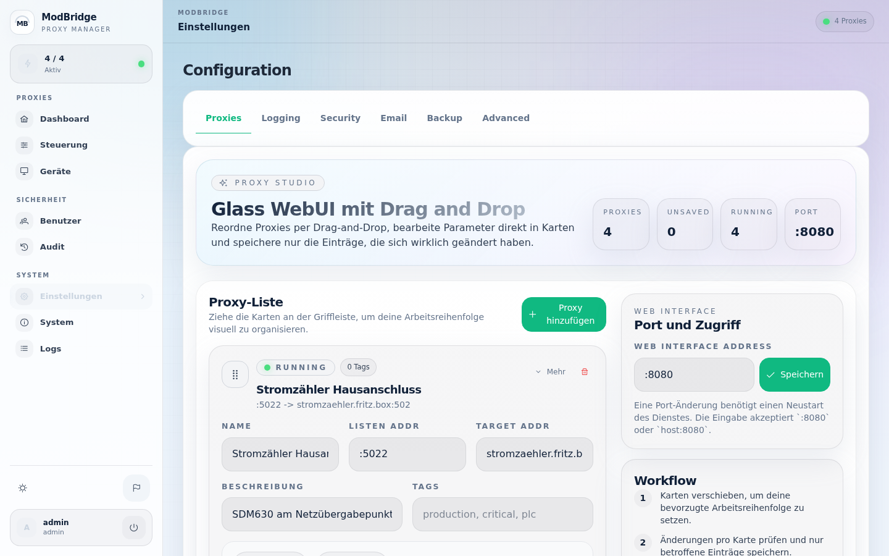
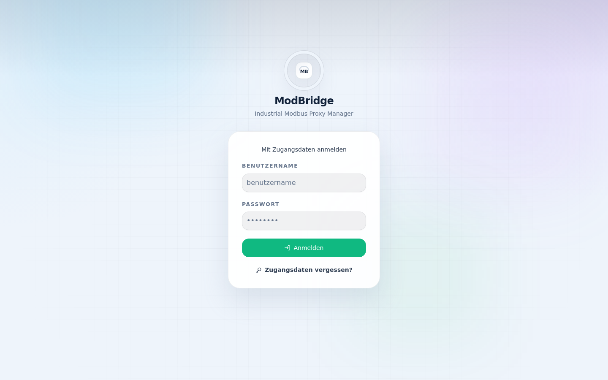
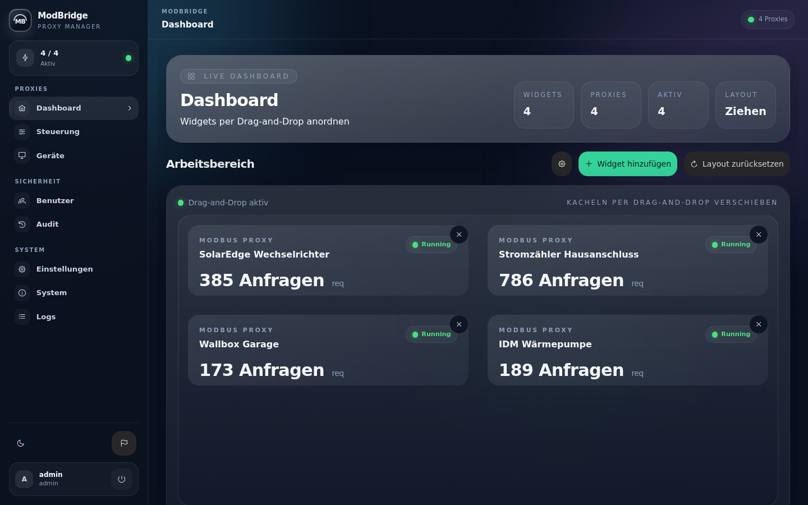
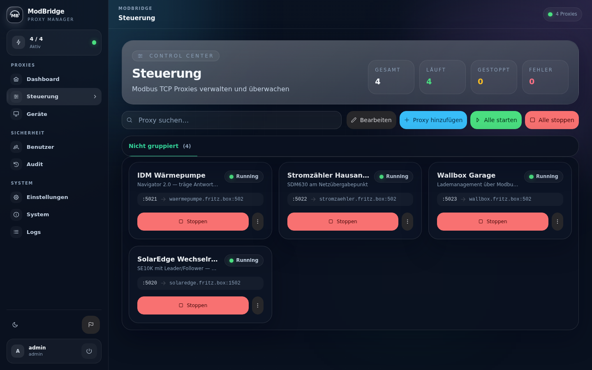
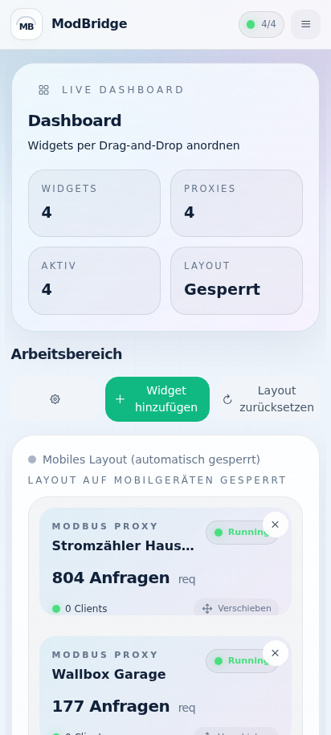
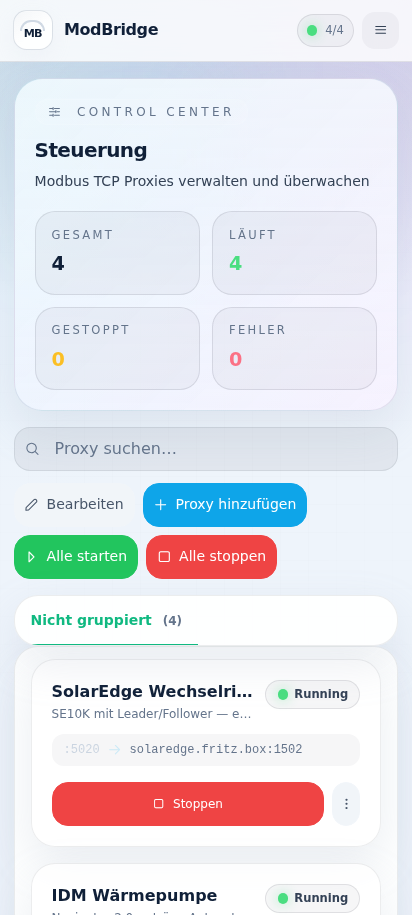

# Web-UI Vorschau / Screenshots

Alle Aufnahmen stammen aus einer laufenden Instanz mit vier Beispiel-Proxys vor
simulierten Geräten. Die Zahlen darin sind gemessen, nicht gezeichnet: der
Wechselrichter beantwortete im Aufnahmezeitraum 110 von 115 Anfragen aus dem
Cache und fragte das Gerät dafür fünfmal.

Die Beispielanlage ist erfunden — `solaredge.fritz.box`, `waermepumpe.fritz.box`
und die übrigen Namen gehören zu keiner realen Installation.

## Wie ModBridge arbeitet

### Zwischen Client und Gerät

### Cache und Hintergrund-Abfrage

### Gerät vermessen

## Die Oberfläche

### Dashboard

Zustand aller Proxys und ihr Durchsatz auf einen Blick. Die Kacheln lassen sich
per Ziehen anordnen.

### Steuerung

Proxys anlegen, starten, stoppen, gruppieren und per Ziehen sortieren.

### Proxy bearbeiten

Geräte-Profil, Abstand, Sitzungslimit, Protokoll und Cache in einem Dialog. Was
ein Profil setzt, steht anschließend in den Einzelfeldern und kann dort
überschrieben werden.

### Gerät vermessen

Der Kasten weiter unten im Proxy-Dialog. Er nennt vorab, was die Messung kostet
— bis zu 90 Sekunden, in denen keine Clients bedient werden — und hält fest,
wann zuletzt gemessen wurde. Über **Letzte Messung ansehen** kommt der
gespeicherte Bericht zurück, ohne dass erneut gemessen werden muss.

### Letzte Messung

Der gespeicherte Bericht: jeder Abstandsschritt mit Fehlerquote und Laufzeiten,
die geprüften Verbindungsstufen, und darunter in Worten, was daraus folgt. Hier
verträgt das Gerät 50 ms und bekommt 100 ms empfohlen; bei 25 ms verwirft es
Anfragen, und eine zweite parallele Sitzung bedient es nicht.

Der Bericht bleibt beim Proxy erhalten, damit niemand eine Messung wiederholen
muss, nur um sie noch einmal zu lesen — und **Werte übernehmen** ist ein eigener
Klick, gemessen wird, entschieden wirst du.

### Geräte

Welche Clients sich verbunden haben, wann zuletzt, und über welchen Proxy.

### Live-Logs

### Konfiguration

### Anmeldung

Beim ersten Start erzeugt ModBridge ein Admin-Passwort und schreibt es ins Log;
danach wird eine Änderung verlangt.

## Dunkles Design

Umschaltbar unten links in der Seitenleiste, neben hell und einem
kontraststarken Schwarzweiß-Design.

## Am Telefon

Die Oberfläche ist für schmale Bildschirme gebaut, nicht nur verkleinert.

| Dashboard | Steuerung |
|---|---|
|  |  |
